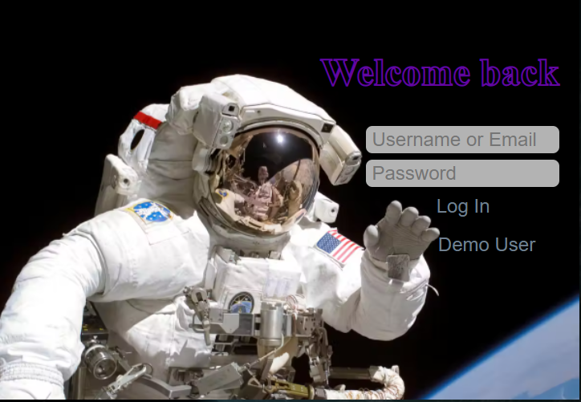
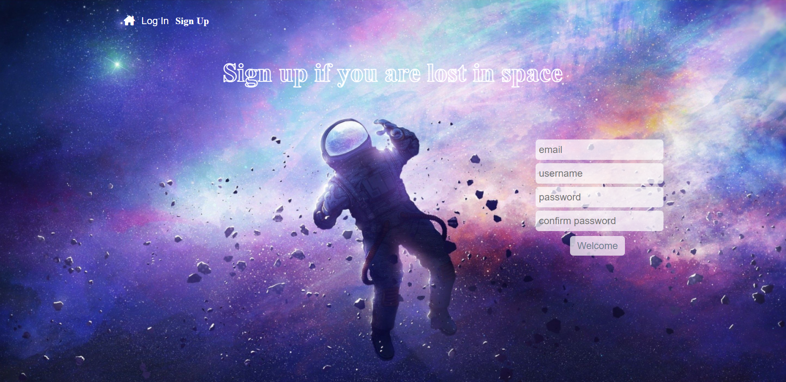
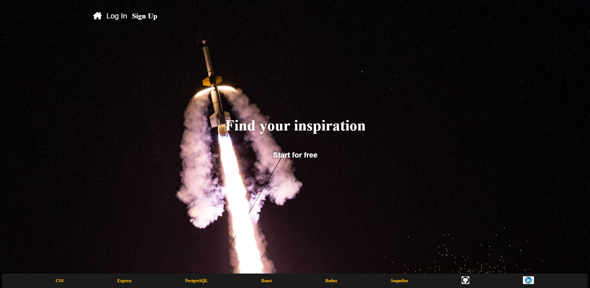
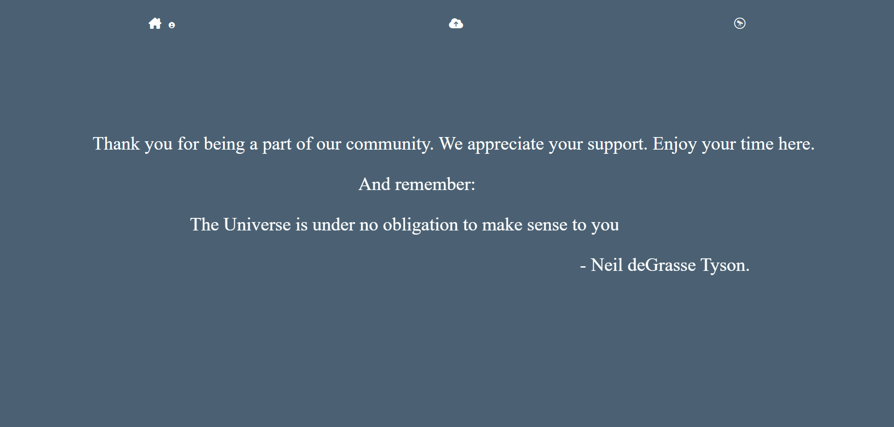
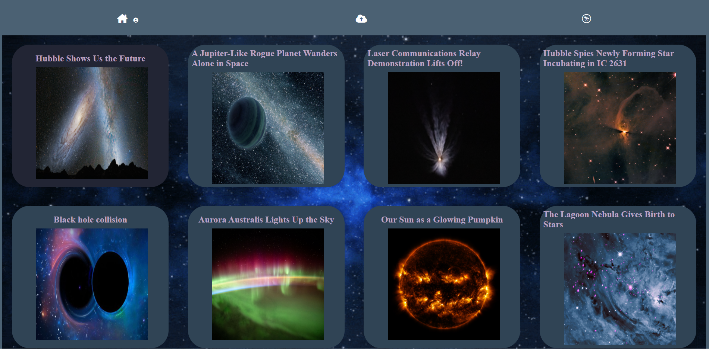
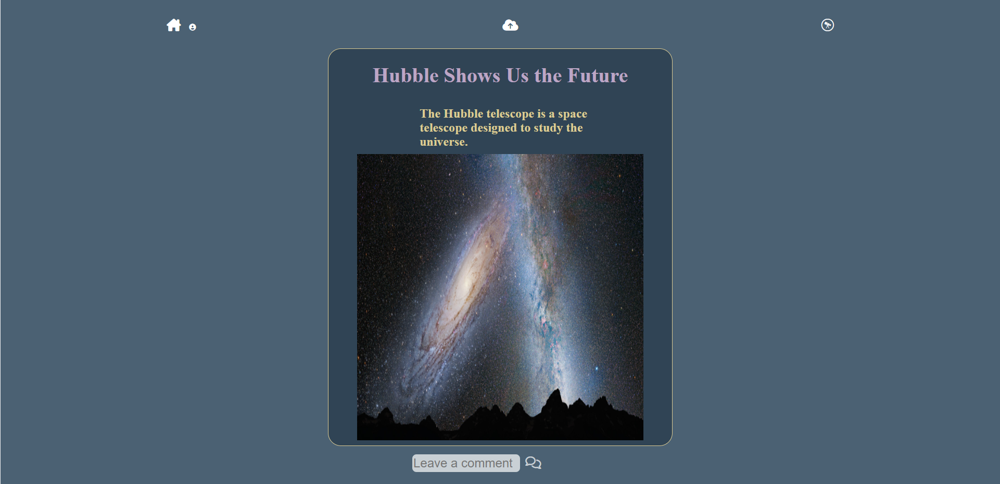

# e_flickr
e-flickr Live Link: https://e-flick.herokuapp.com/

Git wiki: https://github.com/arasargsyan0622/my_flickr/wiki

### Contact 

## e-flickr

---

E-flickr

E-flickr is a space themed clone of Flickr. Logged users can upload images, leave comments to other user's images. 

## Build Instructions

---

1. Download the repo and open it.
2. Cd into backend and frontend respectively and run npm install to install all dependencies.
3. In the backend folder, create a .env file and use .env.example file as a reference. 
4. Set up your postgress user, create the database, migrate and seed all.
5. In your terminal run npm start on both, backend and frontend.

## Technologies Used

---

## E-flickr features

##

### Login and Sign-up form 

### Splash page and Home page

### Explore page

### Image page 

## Future Features

---

- Implement albums and your images page.
- Implement user profiles. 
- Implement Navigation between pictures.
- Implement search feature to search pictures and users
